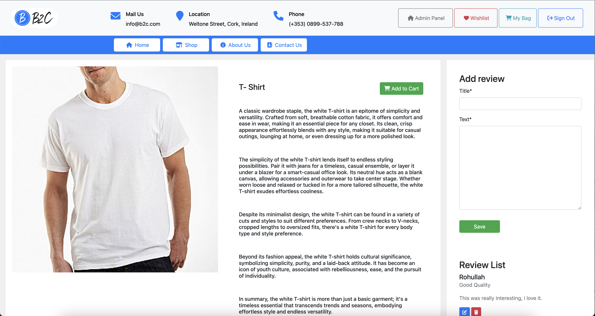

## Afghan Shopping Center | B2C

At Afghan Shopping Center, we pride ourselves on offering an extensive range of high-quality goods, from traditional Afghan handicrafts to modern fashion trends, electronics, home decor, and so much more. Our friendly staff is always on hand to assist you with any questions or special requests, ensuring that your shopping journey is nothing short of delightful.

<a href="https://b2c-7a93138c14a4.herokuapp.com/" target="_blank">Visit the live project here</a>
<a href="https://www.figma.com/file/xfddKV0FnfDPvRt9bVMmU2/Untitled?type=design&mode=design" target="_blank">Visit the live project here</a>

 

## Requirements
Admins have the ability to perform CRUD operations on all posts, reviews, and users, with complete permissions for each.

### Admin Login:
To log in as an admin, please use the following credentials:

- **Username:** rohullah
- **Password:** rohullah

### Normal User Login:
If you want to log in as a normal user, simply click on the register button on the login page.

## User Experience & user stories
### Admin
* As an admin, I want to analyze sales data, track popular products, and identify trends to improve the overall business strategy.
* As an admin, I want to view and manage customer orders, handle cancellations or refunds when necessary.

### LoggedIn User
* As a loggedin user I can add my review for a specific Product.
* As a loggedin user I can edit, delete, and read my review in Product details page.

### Customer User
* As a customer, I want to view my shopping cart summary, including the total cost of items and any applicable discounts or promotions.
* As a customer, I want the ability to modify the quantity of items in my shopping cart or remove items as needed before checkout.
* As a customer, I want to add items to my shopping cart, so I can keep track of the products I intend to buy.
* As a customer, I want to view detailed product information, including price, quantity, nutritional details, and customer reviews, to make informed purchasing decisions.
* As a customer, I want to create an account, so I can log in and manage my grocery orders and preferences easily.
* As a customer, I want to securely proceed to checkout and make payments for my grocery order.
* As a customer, I want to provide feedback or rate the products and overall shopping experience, helping others make better choices.

### Developer Stories
* As a Developer, I want to implement SEO.
* As a developer i should implelement marketing startegies.
* As a Developer, I want to Test html codes for being valide.

### Implemented Agile in GitHub
 

## Features
According to the mentined point at the top the users can use the website with these features:
1. Users can create user account.
2. Users can see the product details.
3. Users can comment and review on product.
4. Users can add to bag the product.
5. Users can checkout.
6. Admins can approve or reject reviews.
7. This a full responsive webapp

## Structure
Simplicity, clarity and ease of navigation between pages were the main aspects for design of this website's structure.

## Design and Development
I have used figma for design of the website.
<a href="https://www.figma.com/file/xfddKV0FnfDPvRt9bVMmU2/Untitled?type=design&mode=design" target="_blank">Here is the link to figma</a>
 

At the top of the page there is a recognisable type of navigation bar with website name on the left side and the navigation links.
### Files & Directories
1. b2c - project directory.
2. utils.py - Contains all Django helper functions used in views.py.
3. urls.py - This file handles all the URLs of the project.
4. store - main application directory.
5. static - contains all static content.
6. css - Contains all css files for styling the webpages.
7. js - Contains all javascript files used in the application.
8. img - Contains all image files used in the application.
9. templates Contains all application templates.
10. index.html - Template for showing all products.
11. product_details.html - Template for showing details for each product.
12. login.html - Login user page.
13. register.html - Register user page.
14. admin.py - Contains some models for access to the Django administrator.
15. models.py - All models used in the application are created here.
16. views.py - This file contains all the application views.
17. requirements.txt - This file contains all contains all the python packages that needs to be installed to run this web application.
18. manage.py - This file is used basically as a command-line utility and for deploying, debugging, or running our web application.

### Database
The backend consists of Python built with the Django framework with a database of a ElephantSQL for the deployed version.

The following models were created to represent the database model structure for the website:
1. ProductModel
2. ReviewModel
3. ContactModel
4. Order
5. OrderLineItem

### Technologies Used
This website is developed and designed using these stack:
1. HTML
2. CSS
3. Bootstrap
4. Javascript
5. Python
6. Django

### Libraries & Tools
1. Bootstrap
2. Cloudinary
3. Chrome dev tools
4. Git
5. GitHub
6. Heroku Platform
7. PostgreSQL

## Testing
### Testing Strategy
I utilised manual and validator testing strategies for the development of the site. In addition to the functionality testing of the site and the testing of the code, User Story tests were implemented to ensure that the criteria of the user stories listed above were met.

### Validator Testing
The site's HTML, CSS and Python codes are validated by the W3C Markup Validation Service, W3C CSS Validation Service and PEP8 ONLINE service.

* HTML HTML docs were run through the W3C Markup validation and passed the validation.

  * Html success report:
   

  * Css All CSS files ran through CSS jigsaw validator with some bootstrap errors that can be ignored.
  
### Manual Testing
1. **Site testing:** I manually tested the site's navigation menu links and all buttons accross the site's all pages that all work fine in terms of loading and redirecting URLs to the relavant pages.

2. **Account Registeration Testing:** I manually tested the register form and entered needed fields. The password needs to meet certain requirements when user regsiter an account.

3. **User exists:** I manually tested that it's not possible to register an account with the same username or the same email address.
 

4. **Login Account** I manually tested the login form. The username and the password needs to be the same as user specified when registering an account.

5. **Post New Product:** I manaually tested product form and the product will be inserted when form filled correctly.

6. **See List of Posts:** I manaually tested loading list of products.
 

7. **Add, Read, Edit and Delete Reviews:** I manaually tested adding review form and it works fine, and i manaually tested edit and delete, they works like they have to work.
 

8. **Add contact form:** I manaually tested contact form and validations, it adds new feedback when form fills properly.
  

9. **See product details:** I manaually tested product details screen it shows every thing properly and responsive.
  

## Deployment:
This project was deployed to Heroku. "Heroku is a cloud platform that lets companies build, deliver, monitor and scale apps."- Heroku.

I used Code Institute GitPod full template to set up an environment to created the project. Installed Django and required packages / libraries using commands in GitPod terminal.

* pip3 install Django==3.2 gunicorn
* pip3 install dj3-cloudinary-storage
* pip3 freeze --local > requirements.txt

### Deployment of This Project

This site was deployed by completing the following steps:

1. Log in to Heroku or create an account
2. On the main page click the New in the top right corner and from the drop-down menu select Create New App
3. You must enter a unique app name
Next select your region
4. Click on the Create App button
5. Click in resources and select Heroku Postgres database
6. Click Reveal Config Vars and add a new record with SECRET_KEY
7. Click Reveal Config Vars and add a new record with the CLOUDINARY_URL
8. Click Reveal Config Vars and add a new record with the DISABLE_COLLECTSTATIC = 1
9. The next page is the project’s Deploy Tab. Click on the Settings Tab and scroll down to Config Vars
10. Next, scroll down to the Buildpack section click Add Buildpack select python and click Save Changes
11. Scroll to the top of the page and choose the Deploy tab
12. Select Github as the deployment method
13. Confirm you want to connect to GitHub
14. Search for the repository name and click the connect button
15. Scroll to the bottom of the deploy page and select the preferred deployment type
16. Click either Enable Automatic Deploys for automatic deployment when you push updates to Github

### Final Deployment
1. Create a Procfile web: gunicorn your_project_name.wsgi
2. When development is complete change the debug setting to: DEBUG = False in settings.py
3. In Heroku settings, delete the config vars for DISABLE_COLLECTSTATIC = 1

### Cloning This Project
Clone this project by following the steps:

1. Open GitHub 
2. You will be provided with three options to choose from, HTTPS, SSH or GitHub CLI, click the clipboard icon in order to - copy the URL
3. Once you click the button the fork will be in your repository
4. Open a new terminal
5. Change the current working directory to the location that you want the cloned directory
6. Type 'git clone' and paste the URL copied in step 3
7. Press 'Enter' and the project is cloned

## Installation
1. Install project dependencies by running py -m pip install -r requirements.txt.
2. Run the commands py manage.py makemigrations and py manage.py migrate in the project directory to make and apply migrations.
3. Create superuser with py manage.py createsuperuser.
4. Run the command py manage.py runserver to run the web server.
5. Open web browser and goto 127.0.0.1:8000 url to start using the web application.

## Credits
During the process of project development, there have been various sources that gave me idea how to do a particular feature or fix a bug. The following are the sources that I got knowledge from:

* Django Allauth
* Code Instiute course materials and Django Blog Walkthrough Project.
* Bootstrap
* The website has been created following YouTube tutorials and stack overflow.
* All images were taken from free websites

---
*Speacial Thanks from Luke Buchanan for helping me on this project!*