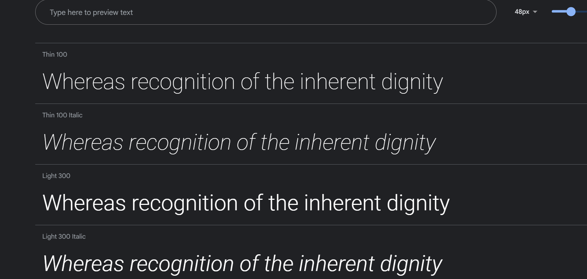

## Afghan Shopping Center | B2C

At Afghan Shopping Center, we pride ourselves on offering an extensive range of high-quality goods, from traditional Afghan handicrafts to modern fashion trends, electronics, home decor, and so much more. Our friendly staff is always on hand to assist you with any questions or special requests, ensuring that your shopping journey is nothing short of delightful.

### E-commerce Platform with a Diverse Product Range
The Afghan Online Shopping Center operates as a comprehensive e-commerce platform, offering a wide variety of products to cater to the diverse needs and preferences of our customers. Our inventory spans multiple categories, including traditional Afghan attire, the latest electronics, home goods, beauty essentials, handmade crafts, and modern fashion trends. This broad spectrum ensures that we meet the shopping requirements of a diverse customer base, both within Afghanistan and globally. By curating a selection that highlights both the rich cultural heritage and the contemporary lifestyle, we provide a unique shopping experience that appeals to a wide audience.

### User-Friendly Interface and Seamless Shopping Experience
Our platform is designed with the user in mind, featuring an intuitive interface that makes it easy to browse, search, and purchase products. We prioritize user experience by ensuring that the website is easy to navigate, with clear categories and a powerful search function that helps customers find exactly what they’re looking for. Additionally, our website is optimized for both desktop and mobile devices, allowing customers to shop conveniently from anywhere. The checkout process is streamlined, with secure payment options and multiple delivery methods to suit the needs of our customers, ensuring a smooth and hassle-free shopping experience.

### Emphasis on Afghan Culture and Heritage
One of the unique aspects of our business model is our commitment to showcasing Afghan culture and heritage through our product offerings. We collaborate with local artisans and craftsmen to bring authentic Afghan handicrafts and traditional attire to the global market. This not only provides our customers with unique and culturally rich products but also supports local communities and helps preserve traditional crafts. By promoting Afghan culture, we create a distinct identity for our brand and build a loyal customer base that values authenticity and cultural heritage.

### Customer-Centric Approach
Customer satisfaction is at the core of our business model. We are dedicated to providing exceptional customer service, with a team of friendly and knowledgeable staff always ready to assist with any inquiries or special requests. Our customer support is accessible through multiple channels, including email, phone, and live chat, ensuring that help is always available when needed. We also encourage customer feedback and continuously improve our services based on their suggestions and experiences. This customer-centric approach helps us build lasting relationships with our customers and fosters loyalty and trust in our brand.


<a href="https://b2c-7a93138c14a4.herokuapp.com/" target="_blank">Visit the live project here</a>
<a href="https://www.figma.com/file/xfddKV0FnfDPvRt9bVMmU2/Untitled?type=design&mode=design" target="_blank">Visit the live project here</a>

 

## Requirements
Admins have full control over the website's content and user management. They can perform CRUD operations on posts, reviews, and users, with complete permissions for each.

To access the admin panel, please use the following login credentials:

- **Username:** rohullah
- **Password:** rohullah

### Normal User Login:
If you want to log in as a normal user, simply click on the register button on the login page.

## User Experience & user stories
### Admin
* As an admin, I want to analyze sales data, track popular products, and identify trends to improve the overall business strategy.
* As an admin, I want to view and manage customer orders, handle cancellations or refunds when necessary.

### LoggedIn User
* As a loggedin user I can add my review for a specific Product.
* As a loggedin user I can edit, delete, and read my review in Product details page.

### Customer User
* As a customer, I want to view my shopping cart summary, including the total cost of items and any applicable discounts or promotions.
* As a customer, I want the ability to modify the quantity of items in my shopping cart or remove items as needed before checkout.
* As a customer, I want to add items to my shopping cart, so I can keep track of the products I intend to buy.
* As a customer, I want to view detailed product information, including price, quantity, nutritional details, and customer reviews, to make informed purchasing decisions.
* As a customer, I want to create an account, so I can log in and manage my grocery orders and preferences easily.
* As a customer, I want to securely proceed to checkout and make payments for my grocery order.
* As a customer, I want to provide feedback or rate the products and overall shopping experience, helping others make better choices.


### Developer Stories
* As a Developer, I want to implement SEO.
* As a developer i should implelement marketing startegies.
* As a Developer, I want to Test html codes for being valide.

### Implemented Agile in GitHub
 

## Features

According to the mentioned points at the top, our website offers the following features for users:

1. User Account Creation: Users have the ability to create their own accounts, allowing them to access personalized features and save their preferences.

2. Product Details: Users can view detailed information about each product, including price, quantity, nutritional details, and customer reviews. This helps them make informed purchasing decisions.

3. Comment and Review: Users can leave comments and reviews on products, sharing their experiences and opinions with others. This allows for a collaborative and interactive shopping experience.

4. Add to Bag: Users can add products to their shopping bag, keeping track of the items they intend to purchase. This feature ensures a convenient and organized shopping experience.

5. Checkout: Users can securely proceed to checkout and make payments for their orders. We offer multiple payment options to cater to different preferences.

6. Admin Review: Our platform allows admins to review and approve or reject user comments and reviews. This ensures the quality and authenticity of the content on our website.

7. Full Responsive Web App: Our website is fully responsive, meaning it adapts to different screen sizes and devices. This provides a seamless and user-friendly experience for all users, whether they are accessing the site from a desktop computer, tablet, or mobile phone.


## Structure
The structure of this website is designed with simplicity, clarity, and ease of navigation in mind. We have carefully crafted the layout to ensure that users can easily find the information they need and navigate between pages seamlessly.

By prioritizing simplicity, we have created a user-friendly experience that allows visitors to quickly understand the organization of the website. The clear and intuitive navigation system ensures that users can easily access different sections and pages without any confusion.

Our goal is to provide a seamless browsing experience, where users can effortlessly explore the content and find what they are looking for. Whether it's accessing product details, reading customer reviews, or learning more about our company, the structure of our website ensures that everything is easily accessible and well-organized.

We understand the importance of a well-structured website in delivering a positive user experience. That's why we have put a lot of thought into designing a structure that is both visually appealing and functional. With our user-centric approach, we aim to make every visit to our website a pleasant and efficient experience.


## Design and Development

Here are some improved designs for this platform that have been created using draw.io.

-  
-  
-  
- 


This platform stands out with its unique color scheme and carefully selected fonts. The combination of vibrant colors and modern typography creates an engaging and visually appealing user experience. The color palette is thoughtfully chosen to reflect the brand's identity and evoke a sense of energy and creativity. The fonts used throughout the platform are carefully selected to ensure readability and enhance the overall aesthetic. The attention to detail in the design elements adds a touch of sophistication and professionalism to the platform's visual appeal.

### Color
-  
### Font
- 


At the top of the page, there is a recognizable navigation bar with the website name on the left side and navigation links.

### Files & Directories

1. **b2c** - The project directory.
2. **utils.py** - Contains all Django helper functions used in views.py.
3. **urls.py** - Handles all the URLs of the project.
4. **store** - The main application directory.
5. **static** - Contains all static content.
  - **css** - Contains all CSS files for styling the webpages.
  - **js** - Contains all JavaScript files used in the application.
  - **img** - Contains all image files used in the application.
6. **templates** - Contains all application templates.
  - **index.html** - Template for showing all products.
  - **product_details.html** - Template for showing details for each product.
  - **login.html** - Login user page.
  - **register.html** - Register user page.
7. **admin.py** - Contains some models for access to the Django administrator.
8. **models.py** - All models used in the application are created here.
9. **views.py** - Contains all the application views.
10. **requirements.txt** - Contains all the Python packages that need to be installed to run this web application.
11. **manage.py** - Used as a command-line utility for deploying, debugging, or running the web application.


### Database

The backend of the website is built using Python and the Django framework. The database used for the deployed version is ElephantSQL.

To represent the database model structure, the following models were created:

1. ProductModel: This model represents the products available on the website.

2. ReviewModel: This model is used to store customer reviews for the products.

3. ContactModel: This model is responsible for storing customer feedback and inquiries.

4. Order: This model represents customer orders placed on the website.

5. OrderLineItem: This model is used to store the individual line items within an order.

These models provide a structured and organized way to store and retrieve data from the database, ensuring efficient and reliable data management for the website.

### Technologies Used
This website is developed and designed using the following stack:

- HTML
- CSS
- Bootstrap
- JavaScript
- Python
- Django

### Libraries & Tools
To enhance the development process, the following libraries and tools were utilized:

- Bootstrap: A popular CSS framework for creating responsive and visually appealing web pages.
- Cloudinary: A cloud-based media management platform used for storing and optimizing images.
- Chrome Dev Tools: A set of web development tools built into the Chrome browser for debugging and optimizing web pages.
- Git: A distributed version control system used for tracking changes in the codebase.
- GitHub: A web-based hosting service for version control repositories, facilitating collaboration and code sharing.
- Heroku Platform: A cloud platform used for deploying, managing, and scaling web applications.
- PostgreSQL: A powerful open-source relational database management system used for storing and retrieving data efficiently.

These technologies, libraries, and tools were carefully chosen to ensure a robust and efficient development process, resulting in a high-quality and user-friendly website.

## Testing
### Testing Strategy
I utilized manual and validator testing strategies during the development of the site. In addition to testing the functionality and code, User Story tests were implemented to ensure that the criteria of the user stories listed above were met.

### Validator Testing
The HTML, CSS, and Python code of the site were validated using the W3C Markup Validation Service, W3C CSS Validation Service, and PEP8 ONLINE service.

- HTML: The HTML documents were run through the W3C Markup validation and passed the validation.

  - HTML success report:
   

  - CSS: All CSS files were validated using the CSS Jigsaw validator, with some bootstrap errors that can be ignored.
  
### Manual Testing
1. **Site testing:** I manually tested the site's navigation menu links and all buttons accross the site's all pages that all work fine in terms of loading and redirecting URLs to the relavant pages.

2. **Account Registeration Testing:** I manually tested the register form and entered needed fields. The password needs to meet certain requirements when user regsiter an account.

3. **User exists:** I manually tested that it's not possible to register an account with the same username or the same email address.
 

4. **Login Account** I manually tested the login form. The username and the password needs to be the same as user specified when registering an account.

5. **Post New Product:** I manaually tested product form and the product will be inserted when form filled correctly.

6. **See List of Posts:** I manaually tested loading list of products.
 

7. **Add, Read, Edit and Delete Reviews:** I manaually tested adding review form and it works fine, and i manaually tested edit and delete, they works like they have to work.
 

8. **Add contact form:** I manaually tested contact form and validations, it adds new feedback when form fills properly.
  

9. **See product details:** I manaually tested product details screen it shows every thing properly and responsive.
  

## Deployment

This project was deployed to Heroku, a cloud platform that enables companies to build, deliver, monitor, and scale apps. To set up the project, I utilized the Code Institute GitPod full template and installed Django and the necessary packages/libraries using the following commands in the GitPod terminal:

```
pip3 install Django==3.2 gunicorn
pip3 install dj3-cloudinary-storage
pip3 freeze --local > requirements.txt
```

### Deployment of This Project

To deploy this project, follow these steps:

1. Log in to Heroku or create a new account.
2. On the main page, click "New" in the top right corner and select "Create New App" from the drop-down menu.
3. Enter a unique app name and select your region.
4. Click "Create App" to proceed.
5. In the resources section, select "Heroku Postgres" as the database.
6. Click "Reveal Config Vars" and add a new record with the key "SECRET_KEY".
7. Click "Reveal Config Vars" again and add a new record with the key "CLOUDINARY_URL".
8. Click "Reveal Config Vars" once more and add a new record with the key "DISABLE_COLLECTSTATIC" and value "1".
9. Go to the project's Deploy Tab and scroll down to the Settings Tab.
10. In the Config Vars section, add the necessary environment variables.
11. Scroll down to the Buildpack section and click "Add Buildpack". Select "Python" and save the changes.
12. Go back to the Deploy tab and choose "GitHub" as the deployment method.
13. Confirm the connection to GitHub and search for the repository name. Click "Connect" to link the repository.
14. Scroll to the bottom of the deploy page and choose the preferred deployment type.
15. Enable Automatic Deploys if you want the project to be automatically deployed when pushing updates to GitHub.


### Final Deployment

To successfully deploy your project, follow these steps:

1. Create a Procfile by running the command `web: gunicorn your_project_name.wsgi` in your project directory. This file tells Heroku how to run your application.

2. Once your development is complete, change the `DEBUG` setting to `False` in your `settings.py` file. This ensures that your application runs in production mode and provides better security.

3. In your Heroku settings, delete the `DISABLE_COLLECTSTATIC` config vars. This allows Heroku to collect and serve your static files automatically.

By following these steps, you will have a smooth and successful deployment of your project on Heroku.


### Cloning This Project

To clone this project, follow these steps:

1. Open GitHub and navigate to the repository.
2. Click on the "Code" button to reveal the cloning options.
3. Choose either HTTPS, SSH, or GitHub CLI as the cloning method.
4. Click on the clipboard icon to copy the URL.
5. Open a terminal or command prompt.
6. Navigate to the directory where you want to clone the project.
7. Type `git clone` followed by the copied URL.
8. Press Enter to start the cloning process.
9. Wait for the project to be cloned successfully.

Now you have successfully cloned the project to your local machine.


## Installation

To install and run the web application, follow these steps:

1. Install project dependencies by running the following command in the project directory:
  ```
  py -m pip install -r requirements.txt
  ```

2. Make and apply migrations by running the following commands:
  ```
  py manage.py makemigrations
  py manage.py migrate
  ```

3. Create a superuser by running the following command:
  ```
  py manage.py createsuperuser
  ```

4. Start the web server by running the following command:
  ```
  py manage.py runserver
  ```

5. Open a web browser and go to `127.0.0.1:8000` to access the web application.

Enjoy using the web application!
## Credits

During the process of project development, I have gained knowledge and inspiration from various sources. The following sources have been instrumental in helping me implement specific features and resolve bugs:

- Online tutorials and documentation
- Stack Overflow community
- Code Institute course materials
- YouTube tutorials
- Bootstrap documentation
- Free image websites

I am grateful for the valuable resources provided by these sources, which have contributed to the success of this project.


The technologies and resources utilized in the development of this website include:

* Django Allauth: A powerful authentication and authorization framework for Django, used to handle user registration, login, and account management.

* Code Institute course materials and Django Blog Walkthrough Project: These resources provided valuable guidance and insights into building a Django-based blog application.

* Bootstrap: A popular CSS framework that was used to create responsive and visually appealing web pages, ensuring a seamless user experience across different devices.

* YouTube tutorials and Stack Overflow: These platforms served as valuable sources of information and guidance throughout the development process, providing solutions to specific challenges and helping to enhance the functionality of the website.

* Free image websites: All images used in the website were sourced from free websites, ensuring compliance with copyright regulations and providing visually appealing content for the users.

By leveraging these technologies and resources, the website was developed with a focus on functionality, usability, and aesthetics, resulting in a high-quality and user-friendly web application.


---
*Speacial Thanks from Luke Buchanan for helping me on this project!*